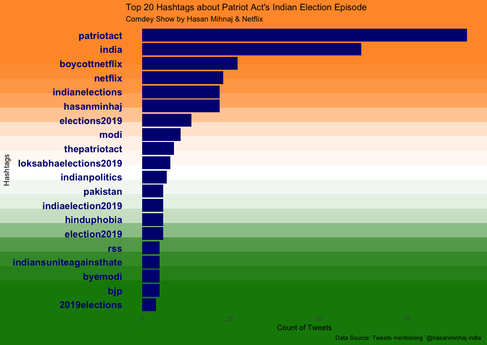
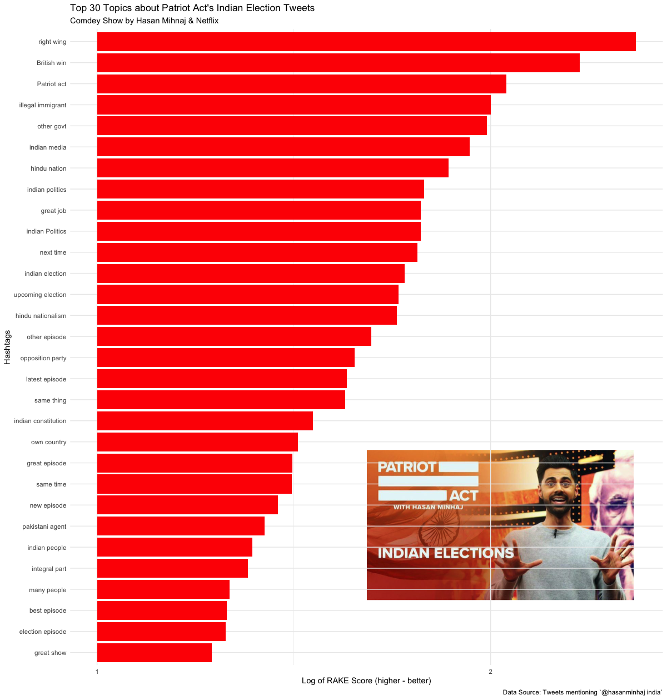

# Introduction to Tweet Analysis
## Hasan Minhaj's Indian Elections Episode Tweets Analysis

### Objective

+ Learn how to get started with Twitter (Tweets) Analysis using R 
+ Use-cse: Analysing the tweets made about the Netflix show Patriot Act's Episode: [Indian Elections (A Show by US Comedian Hasan Minhaj)](https://www.youtube.com/watch?v=qqZ_SH9N3Xo)

### Sample Output

### [Presentation HTML](https://amrrs.github.io/intro_to_tweets_analysis/presentation.html#1)

### [Presentation PDF](presentation.pdf)
